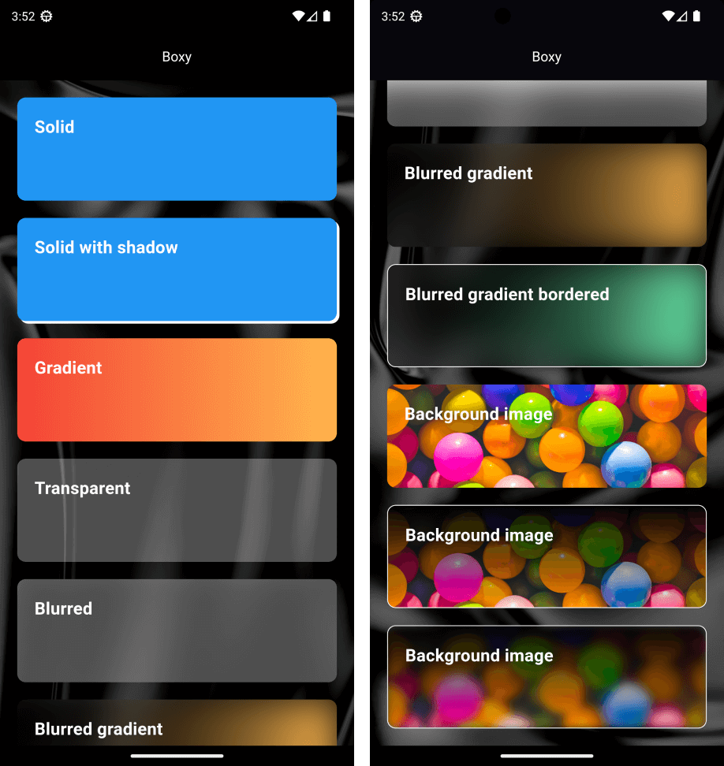

# Boxy

> A simple way to create boxes on flutter

## Features

- Solid color
- Gradiend color
- Shadow
- Blur effect with gradient and images
- Image background
- Custom border radius
- Width, height, padding, margin

**Example:**

---

Carlos Costs @ 2023
